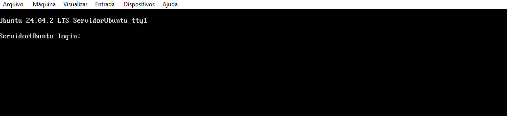

# Preparação de ambiente
 Criar ima maquina virtual para instalar as ferramentas e dependencias para o estudo de algoritimo e logica de programação

 ## Criar o diretorio base
 Vamos criar um diretorio para guardar a nossa maquina virtual. Será criado no drive D. Nomeada com o nome do usuario.

 

 ## Preparação da maquina virtual
 ### Vamos usar a ferramenta de virtualização chamdada Virtual Box


<a href="https://www.virtualbox.org/wiki/Downloads"> faça o downloads aqui </a>
##  Criando a maquina vitual


# Crie uma maquina virtual com as seguintes configurações:
- Crie um diretorio no drive D para alocar a sua maquina virtual
- processador: 2
- memoria: 4096
- disco: 100BG dinamicamente alocado
- memoria de video: 128
- ISO: Ubuntu 24.04
       - Idioma: Portugues Brasil
       - Localização: São Paulo
       - usuario: Senac
       - Senha: Jucapato
       - Comandos de atualização do sistema:
               - sudo apt update -y
               - sudo apt update -y
               - reboot
               - instalar o cockpit




## Pos instalação:
para atulizar o sistema iremos usar os seguintes Comandos:

```shell
sudo apt update -y && sudo apt upgrade -y
```

## instalação do cockpit

ferramenta para gerenciar o servidor, por meio de um ambiente grafico online


### comando para instalar o cockpit

```shell
sudo apt install cockpit -y
```


